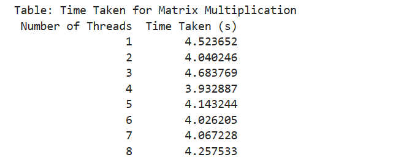
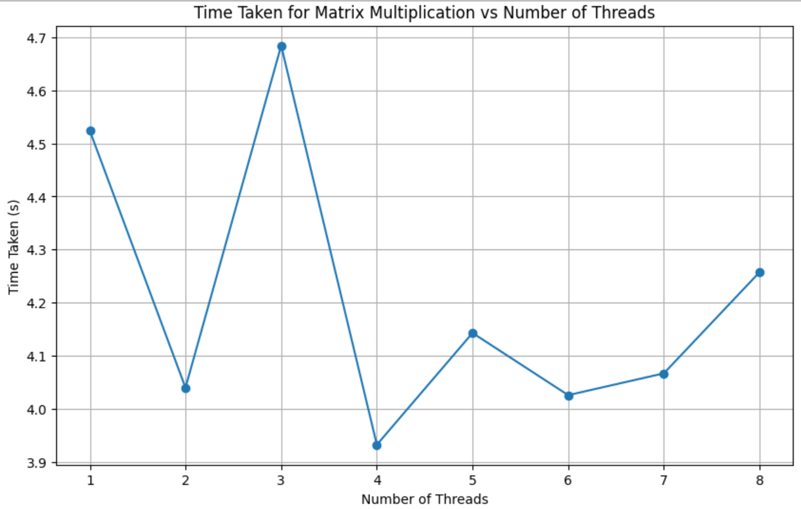
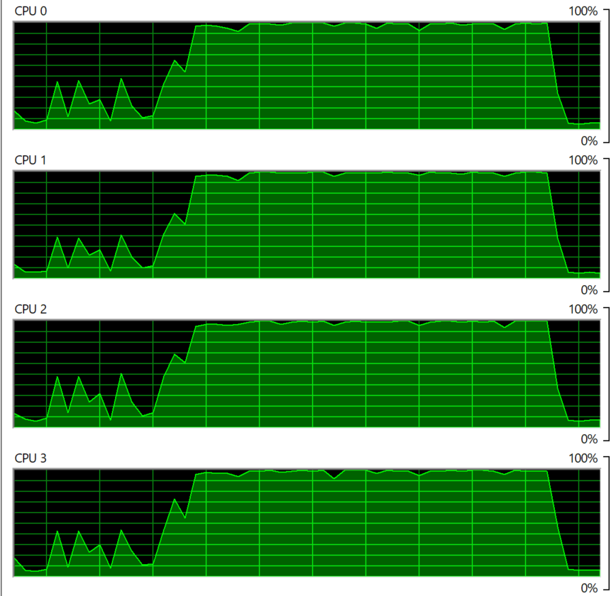

# Multi_Threading
Multithreading is a form of parallelization or dividing up work for simultaneous processing.
Assignment on Multi-Threading

## Methodology
1. The Generate_random_matrix function makes a random matrix of size 1000x1000.
2. Multiply function performs matrix multiplication of a given matrix and a constant matrix.
3. Multiply_with_threads function takes a list of matrices and the number of threads to use.
4. Then it uses the concurrent.futures.ThreadPoolExecutor distributes the matrix multiplication tasks among multiple threads and measures the time it takes to complete the multiplication.
5. The Generate_random_matrix function generates a list of 100 random matrices.
6. Measure the time to multiply matrices by a specific number of threads (1 to 8).
7. Display the results in a table and plot a graph for execution time.

## Time Taken vs Number of Threads Table

## Time Taken vs Number of Threads Graph

## CPU Usage

